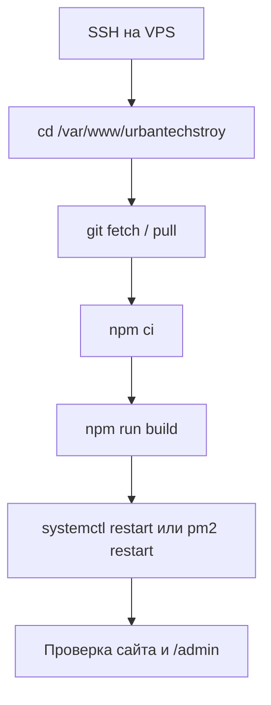

# Деплой UrbanTechStroy (Git + VPS)

Сайт — **Nuxt 3** с Nitro preset **`node-server`**: один процесс Node обслуживает и HTML, и API (`/api/...`), SQLite и загрузки из админки. Статической раздачи «только из `dist`» без Node **недостаточно**.

---

## 1. Что изменилось по сравнению со старым продом

| Раньше (типично)        | Сейчас                                                                                       |
| ----------------------- | -------------------------------------------------------------------------------------------- |
| Только фронт / статика  | **Обязателен Node.js** на VPS                                                                |
| Без БД                  | **SQLite** (`site.db`) — контент, админы, сессии, лиды                                       |
| Без серверных загрузок  | Папка **`.data/uploads`** — картинки из админки                                              |
| Один репозиторий = сайт | Тот же Git, но на сервере: **`git pull` → `npm ci` → `npm run build` → перезапуск процесса** |

Важно: каталог **`.data`** (или пути из `NUXT_DATABASE_PATH` / `NUXT_UPLOAD_DIR`) должен жить **вне** сценария «каждый деплой удаляю всю папку проекта», иначе потеряете БД и файлы.

---

## 2. Требования к VPS

- **Ubuntu/Debian** (или другой Linux) с SSH.
- **Node.js** актуальной LTS (рекомендуется **20.x или 22.x**), совпадающая или близкая к версии на машине, где вы собираете проект.
- **npm** (или `pnpm`/`yarn`, если переведёте проект).
- **Git**.
- Для продакшена: **Nginx** (или Caddy) как reverse proxy на `127.0.0.1:PORT` + **HTTPS** (Let’s Encrypt).
- Пакет **`better-sqlite3`** содержит нативные модули: после `npm ci` на сервере при смене версии Node иногда нужен **`npm rebuild better-sqlite3`**.

Проверка версий на сервере:

```bash
node -v
npm -v
git --version
```

---

## 3. Первый деплой «с нуля» на VPS (обновление со старого статического варианта)

### 3.1. Пользователь и каталог

Работайте под отдельным пользователем (например `deploy`), не под root:

```bash
sudo mkdir -p /var/www/urbantechstroy
sudo chown deploy:deploy /var/www/urbantechstroy
cd /var/www/urbantechstroy
```

### 3.2. Клонирование репозитория

```bash
git clone https://github.com/ВАШ_АККАУНТ/UrbanTechStroy.git .
# или SSH: git@github.com:...
```

### 3.3. Данные, которые не должны пропадать при деплое

Создайте каталог для постоянных данных **вне** `git clean` (или используйте путь вне репозитория):

```bash
sudo mkdir -p /var/lib/urbantechstroy
sudo chown deploy:deploy /var/lib/urbantechstroy
```

Дальше в `.env` (см. ниже) укажите, например:

- `NUXT_DATABASE_PATH=/var/lib/urbantechstroy/site.db`
- `NUXT_UPLOAD_DIR=/var/lib/urbantechstroy/uploads`

Тогда репозиторий можно пересобирать сколько угодно — БД и загрузки останутся.

Если не задавать переменные, по умолчанию приложение пишет в **`.data/site.db`** и **`.data/uploads`** **относительно текущей рабочей директории** при запуске Node. Тогда запускайте процесс **из корня проекта** и не удаляйте `.data` при деплое.

### 3.4. Переменные окружения

Скопируйте пример и отредактируйте:

```bash
cp .env.example .env
nano .env
```

Минимум для продакшена:

| Переменная                                 | Назначение                                                      |
| ------------------------------------------ | --------------------------------------------------------------- |
| `NUXT_PUBLIC_SITE_URL`                     | `https://ваш-домен.ru` без слэша в конце (OG, canonical)        |
| `NUXT_ADMIN_EMAIL` + `NUXT_ADMIN_PASSWORD` | Первый админ создаётся/синхронизируется при старте (см. README) |
| _или_ `NUXT_ADMIN_SETUP_KEY`               | Регистрация первого админа на `/admin/register`                 |
| `NUXT_DATABASE_PATH`                       | (опционально) абсолютный путь к SQLite                          |
| `NUXT_UPLOAD_DIR`                          | (опционально) каталог загрузок из админки                       |

Файл `.env` **не коммитьте**; на сервере держите его только локально или в секретах CI.

### 3.5. Установка зависимостей и сборка

```bash
cd /var/www/urbantechstroy
npm ci
npm run build
```

Артефакт: каталог **`.output/`** (Nitro). Запуск:

```bash
node .output/server/index.mjs
```

По умолчанию слушает **порт 3000** (или `PORT` / `NITRO_PORT` из окружения). Для прода обычно `127.0.0.1:3000` за Nginx.

### 3.6. Systemd (пример)

`/etc/systemd/system/urbantechstroy.service`:

```ini
[Unit]
Description=UrbanTechStroy Nuxt Nitro
After=network.target

[Service]
Type=simple
User=deploy
WorkingDirectory=/var/www/urbantechstroy
EnvironmentFile=/var/www/urbantechstroy/.env
Environment=NODE_ENV=production
Environment=HOST=127.0.0.1
Environment=PORT=3000
ExecStart=/usr/bin/node .output/server/index.mjs
Restart=on-failure
RestartSec=5

[Install]
WantedBy=multi-user.target
```

```bash
sudo systemctl daemon-reload
sudo systemctl enable --now urbantechstroy
sudo systemctl status urbantechstroy
```

После **любого** изменения `.env`: `sudo systemctl restart urbantechstroy`.

### 3.7. Nginx (пример reverse proxy)

```nginx
server {
    listen 443 ssl http2;
    server_name ваш-домен.ru;

    # ssl_certificate ... (certbot)

    location / {
        proxy_pass http://127.0.0.1:3000;
        proxy_http_version 1.1;
        proxy_set_header Host $host;
        proxy_set_header X-Real-IP $remote_addr;
        proxy_set_header X-Forwarded-For $proxy_add_x_forwarded_for;
        proxy_set_header X-Forwarded-Proto $scheme;
    }

    client_max_body_size 12M;
}
```

Админка использует **cookie** сессии: сайт и `/admin` должны быть с **одного домена** и по возможности **HTTPS**, иначе браузер может не отправлять cookie.

---

## 4. Повторный деплой (редеплой) — подробная схема

Ниже — схема для типичного случая, как у вас на скриншоте: **в `/var/www/urbantechstroy` лежит клон Git** (`app`, `components`, `pages`, `public`, `nuxt.config.ts`, `package.json`, `node_modules` и т.д.). Сайт в продакшене крутится как **процесс Node**, который запускает уже собранный сервер из **`.output/server/index.mjs`** (после `npm run build`).

### 4.1. Логика в одном абзаце

1. **Git** подтягивает новый код в ту же папку.
2. **`npm ci`** ставит зависимости ровно по `package-lock.json` (чисто и воспроизводимо).
3. **`npm run build`** пересобирает Nuxt → появляется/обновляется каталог **`.output/`**.
4. **Перезапуск** systemd или PM2 подхватывает новый `.output` и при необходимости новый `.env`.

Файлы **`.env`**, **`.data/`** (или пути из `NUXT_DATABASE_PATH` / `NUXT_UPLOAD_DIR`) **Git обычно не трогает** — они остаются на диске, если вы сами их не удаляете и не делаете жёсткий `git clean -fdx`.

### 4.2. Блок-схема (поток)



### 4.3. Пошаговые команды (копируйте по порядку)

Подключитесь по SSH (у вас пользователь может быть `ubuntu` или другой — подставьте своего):

```bash
ssh ubuntu@ВАШ_IP
cd /var/www/urbantechstroy
```

**Шаг 1 — посмотреть, что сейчас в репозитории (по желанию):**

```bash
git status
git branch
```

Убедитесь, что нет незакоммиченных правок на сервере, которые вы хотите сохранить. Если сервер — только для деплоя, обычно `git status` чистый.

**Шаг 2 — забрать код с удалённого репозитория:**

```bash
git fetch origin
git checkout main
git pull origin main
```

Если основная ветка не `main`, замените на свою (например `master`).

**Шаг 3 — зависимости:**

```bash
npm ci
```

Используйте именно **`npm ci`**, а не `npm install`: так на проде ставится ровно то, что зафиксировано в `package-lock.json`, без «плавающих» версий.

Если после обновления Node на сервере падает сборка на **`better-sqlite3`**, выполните:

```bash
npm rebuild better-sqlite3
```

**Шаг 4 — сборка продакшена:**

```bash
npm run build
```

В конце должно быть без ошибок; в каталоге проекта обновится **`.output/`** — его и читает запущенный процесс.

**Шаг 5 — перезапуск приложения:**

Если настроен **systemd** (как в разделе 3.6):

```bash
sudo systemctl restart urbantechstroy
sudo systemctl status urbantechstroy
```

Если используете **PM2**:

```bash
pm2 restart urbantechstroy
pm2 logs urbantechstroy --lines 50
```

Имя процесса в PM2 может отличаться — посмотрите `pm2 list`.

**Шаг 6 — быстрая проверка:**

- Открыть главную и пару внутренних страниц.
- Форма заявки / калькулятор (если используете).
- **`/admin/login`** — вход и раздел с контентом.

Nginx при этом **не обязательно** перезапускать: он только проксирует на тот же порт Node.

### 4.4. Что у вас на сервере «видно по списку файлов»

- Папки **`components`**, **`pages`**, **`public`** — исходники и статика; после деплоя они должны совпасть с Git.
- **`node_modules`** — ставится заново через `npm ci`, не коммитится в Git.
- **`.output`** — появляется после `npm run build`; именно оттуда в проде должен стартовать Node.
- Папка **`3001`** в корне не стандартна для Nuxt: часто это старый эксперимент, копия проекта или артефакт. Если приложение из неё не запускается, её можно не трогать или удалить **только** после проверки, что она нигде не используется.

### 4.5. Время простоя

Пока идёт `npm run build`, старый процесс Node может ещё работать на **старом** `.output` (если вы не останавливали сервис заранее). После **`restart`** на доли секунды возможен обрыв соединений — это нормально. Если нужен «нулевой» даунтайм, настраивают два инстанса и поочерёдное переключение (blue-green) — для одного VPS обычно избыточно.

### 4.6. Если деплой сломал сайт

```bash
cd /var/www/urbantechstroy
git log --oneline -5
git checkout ХЕШ_ПРЕДЫДУЩЕГО_КОММИТА
npm ci
npm run build
sudo systemctl restart urbantechstroy
```

Потом разберите ошибку на тестовой ветке и снова задеплойте `main`.

### 4.7. Чего не делать без нужды

- **`git clean -fdx`** — сотрёт неотслеживаемые файлы, в том числе **`.env`** и **`.data`**, если они не в `.gitignore` неправильно или вы удалили ignore.
- Удалять **`.data`** вручную — потеряете БД (лиды, админы, правки контента) и загрузки из админки.
- **`rm -rf node_modules .output`** без следующих **`npm ci`** и **`npm run build`** — процесс перезапустится уже «в пустоту».

---

## 5. PM2 (альтернатива systemd)

```bash
cd /var/www/urbantechstroy
npm ci && npm run build
pm2 start .output/server/index.mjs --name urbantechstroy
pm2 save
pm2 startup   # один раз — следовать подсказке
```

Обновление: те же `git pull`, `npm ci`, `npm run build`, затем `pm2 restart urbantechstroy`.

Загрузите переменные: `pm2 start ... --env production` или `ecosystem.config.cjs` с `env_file: '.env'`.

---

## 6. Бэкапы

Регулярно копируйте:

- файл SQLite (`site.db` или путь из `NUXT_DATABASE_PATH`);
- каталог загрузок (`NUXT_UPLOAD_DIR` или `.data/uploads`).

Пример:

```bash
tar -czf backup-$(date +%F).tar.gz /var/lib/urbantechstroy
```

---

## 7. Частые проблемы

| Симптом                             | Что проверить                                                                                   |
| ----------------------------------- | ----------------------------------------------------------------------------------------------- |
| 502 от Nginx                        | Запущен ли `node`/systemd, слушает ли `PORT`, совпадает ли `proxy_pass`                         |
| Админка не логинит                  | HTTPS, один домен, cookie; перезапуск после смены `.env`                                        |
| «Cannot find module better_sqlite3» | `npm ci` на сервере, та же архитектура; `npm rebuild better-sqlite3`                            |
| После деплоя пропали лиды/картинки  | БД и uploads не в том месте / удалили `.data` при деплое                                        |
| Сборка падает по памяти             | На маленьком VPS добавьте swap или собирайте в CI и выкладывайте `.output` (отдельный pipeline) |

---

## 8. Краткий чеклист перед первым запуском на проде

- [ ] Node LTS установлен, `npm ci` проходит.
- [ ] `npm run build` проходит без ошибок.
- [ ] `.env` заполнен (`NUXT_PUBLIC_SITE_URL`, админ bootstrap или `NUXT_ADMIN_SETUP_KEY`).
- [ ] Пути к БД и uploads — на постоянном диске, права на запись у пользователя процесса.
- [ ] Systemd/PM2 настроен, `Restart=on-failure`.
- [ ] Nginx → `127.0.0.1:PORT`, HTTPS, `client_max_body_size` для загрузки картинок.
- [ ] Настроен бэкап `/var/lib/urbantechstroy` (или ваших путей).

Подробности по админке и переменным — в **README.md** (раздел «Админ-панель»).

---

## 9. Шпаргалка: сначала GitHub, потом VPS (SSH / Git Bash)

### На своём ПК (Git Bash), в папке проекта

1. Убедитесь, что в **`.gitignore`** есть `.nuxt`, `.output`, `node_modules`, `.env`, `.data` (в этом репозитории уже добавлено). На скрине старого репо они попали в Git — так лучше не хранить.
2. Если **`.nuxt` / `.output` уже когда-то закоммичены**, один раз уберите из индекса (файлы на диске останутся):

   ```bash
   git rm -r --cached .nuxt .output 2>/dev/null
   git rm -r --cached 3001 2>/dev/null
   ```

3. Закоммитьте актуальный код и отправьте на GitHub (ветка `main` или ваша):

   ```bash
   git add -A
   git status
   git commit -m "Обновление: админка, БД, правки"
   git push origin main
   ```

### На VPS (SSH), в каталоге сайта (у вас `/var/www/urbantechstroy`)

```bash
cd /var/www/urbantechstroy
git pull origin main
npm ci
npm run build
sudo systemctl restart urbantechstroy
```

Если сервис называется иначе — вместо последней строки: `pm2 restart ИМЯ` или как у вас настроено.

После `git pull` на сервере папки **`.nuxt` / `.output` из репозитория** могут обновиться или исчезнуть — не страшно: **`npm run build` всё пересоберёт** локально на VPS.
